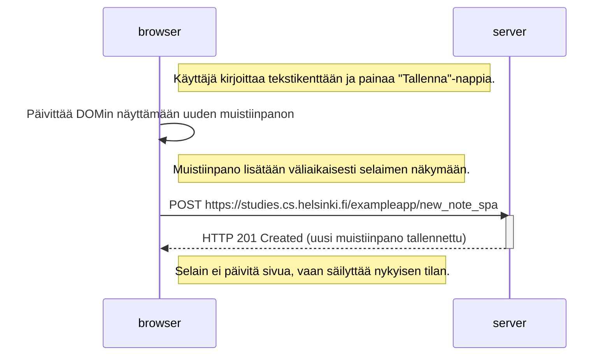

```mermaid
sequenceDiagram
    participant browser
    participant server

    Note right of browser: Käyttäjä kirjoittaa tekstikenttään ja painaa "Tallenna"-nappia.

    browser->>browser: Päivittää DOMin näyttämään uuden muistiinpanon
    Note right of browser: Muistiinpano lisätään väliaikaisesti selaimen näkymään.

    browser->>server: POST https://studies.cs.helsinki.fi/exampleapp/new_note_spa
    activate server
    server-->>browser: HTTP 201 Created (uusi muistiinpano tallennettu)
    deactivate server

    Note right of browser: Selain ei päivitä sivua, vaan säilyttää nykyisen tilan.
```
